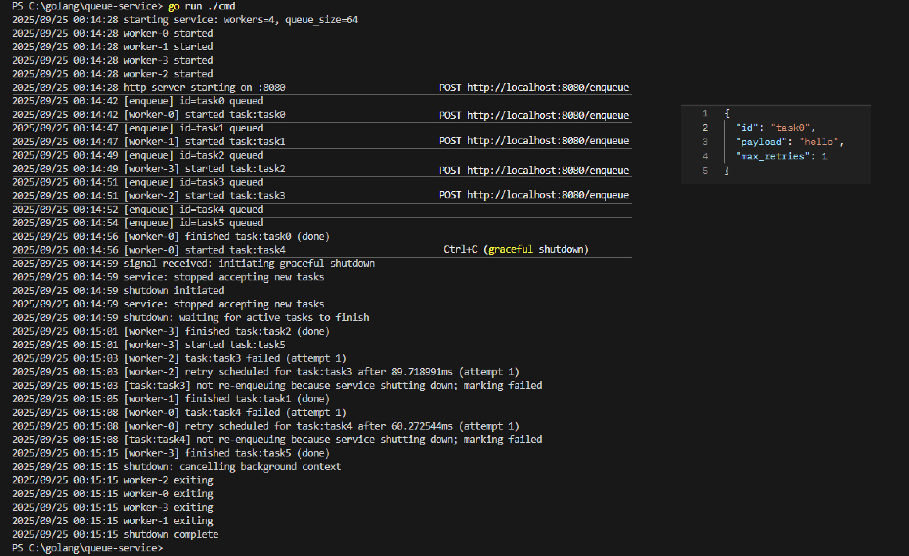

# Queue Service

Внутренняя очередь для фоновой обработки входящих задач

## Описание

Сервис принимает задания через HTTP (POST /enqueue), ставит их в очередь и обрабатывает пулом воркеров.

Поддерживаются повторные попытки с экспоненциальным бэкоффом и джиттером, хранение и обновления состояния задач (queued | running | done | failed), а также корректное завершение (graceful shutdown).

Проект написан без сторонних библиотек, только стандартная библиотека Go 1.24.

## Возможности

- Приём задач через POST /enqueue
- Задание попадает в буферизированную очередь (размер - из конфигурации)
- Авторизация не требуется
- Задания обрабатываются пулом воркеров (WORKERS настраиваются)
- Состояния задач: `queued | running | done | failed`
- При "падении" задачи происходит повторная обработка с экспоненциальным бэкоффом и джиттером
- Healthcheck `/healthz`
- Корректное завершение по `SIGINT`/`SIGTERM`:
  - Сервис перестает принимать новые задачи
  - Сервис ожидает завершения текущих задач

## Конфигурация

Через переменные окружения:

| Переменная    | Описание                     | Значение по умолчанию |
|---------------|------------------------------|------------------------|
| `WORKERS`     | Количество воркеров          | `4`                    |
| `QUEUE_SIZE`  | Размер буферизированной очереди | `64`                |


Возможность изменить значения перед запуском сервиса на **Windows (PowerShell)**:
```powershell
$env:WORKERS=<value>
$env:QUEUE_SIZE=<value>
```
На **Linux/macOS**:
```bash
export WORKERS=<value>
export QUEUE_SIZE=<value>
```
Запуск программы:
```
go run ./cmd
```
## API

```
POST `/enqueue`
```

Добавить задачу в очередь

**Тело запроса:**
```json
{
  "id": "task1",
  "payload": "data",
  "max_retries": 3
}
```
Ожидаемый ответ:

200 OK - задача успешно обновлена

503 Service Unavailable - очередь переполнена

**Проверка доступности сервиса:**
```
GET /healthz
```
Ожидаемый ответ:
200 OK - сервер доступен

Также сервис покрыт модульными тестами

## Пример использования
